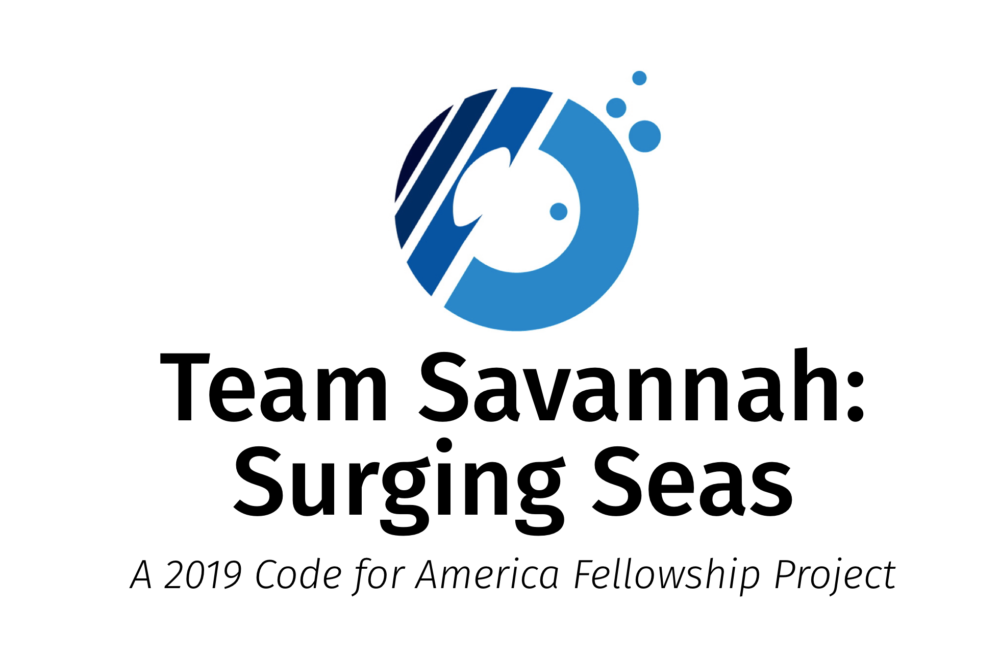

# Sea-Level-Rise Localization Framework and Climate Justice Assessment Data



## Goals of Fellowship Project

Broadly, the aims of this project can be split into four categories, comprising what we refer to as the '**SAFE**' framework:



**Make real-time sea-level-rise data tools easy to understand, simple to use and engaging for everyday residents.**

1. _Make SLR visual._ ****Too often, researchers present dense statistical data graphics to depict SLR that are generated using analytics software such as R or Python. While the analysis process is highly accurate and replicable, the output isn't tailored for real people.
2. Make SLR relatable.
3. Make SLR highly local.
4. 















## Goals

* Climate action  
* Sustainable Community Development to Build Climate Resilience 

 Super-powers are granted randomly so please submit an issue if you're not happy with yours.

Once you're strong enough, save the world:

```
// Ain't no code for that yet, sorry
echo 'You got to trust me on this, I saved the world'
```


